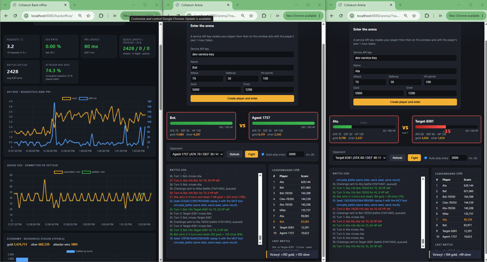
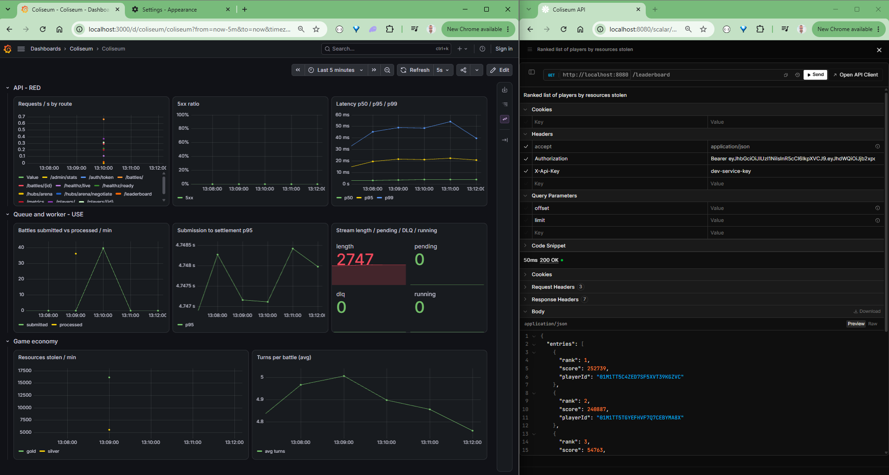
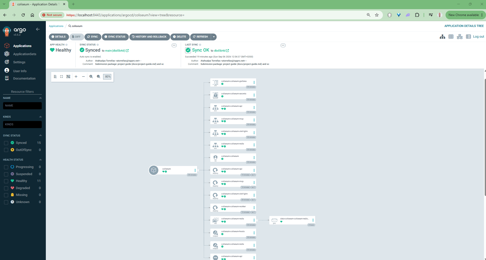

# Coliseum: project guide

Companion document for the submission of the *Backend Development Hands-on Test* (Senior Server Engineer).
Author: Atahualpa Torrellas. Repository: https://github.com/atorrellascz/coliseum (the bundle contains the same
history: branch `main` and tag `v1.0.0`).

This guide explains how to open the bundle, how the repository is organised, where each requirement of the task is
implemented and tested, and what every document in the repository is for, so a reviewer can go straight to what
interests them. Everything in the repository is in English.

## 1. Opening the bundle and running it

```bash
git clone Torrellas_Atahualpa.bundle coliseum && cd coliseum        # a bundle clones like a remote
docker compose -f deploy/compose/docker-compose.yml up --build -d    # ≈ 4 min the first time
bash scripts/smoke.sh                                                # ends with "SMOKE OK"
```

Then open http://localhost:8080/scalar (API reference with "try it"), http://localhost:8080/arena/?name=Ata&auto=1
(a player fighting live; open a second tab with another name), http://localhost:8080/backoffice/ (operations
console, API key `dev-service-key`) and http://localhost:3000 (Grafana, admin/admin, dashboard "Coliseum").

Without Docker: .NET 10 SDK and a local Redis, then `dotnet run --project src/Coliseum.Api` and
`dotnet run --project src/Coliseum.Worker` (details in `README.md` §Running from source). Tests:

```bash
dotnet test --project tests/Coliseum.UnitTests           # 112: engine, use cases, architecture
dotnet test --project tests/Coliseum.RegressionTests     # 10 golden battle reports
dotnet test --project tests/Coliseum.IntegrationTests    # 36 against a real Redis (Testcontainers)
```

The same three suites plus `dotnet format`, image builds with a Trivy gate, `helm lint` + kubeconform and
`terraform validate` run in GitHub Actions on every push (`.github/workflows/ci.yml`).

## 2. What was built

The task asks for a backend service (players, battle queue, leaderboard), a battle processor and a battle engine,
with security, concurrency without overlapping players, tests and documentation. The submission covers all of it and
adds what a production service would need around it:

| Area | Delivered |
|------|-----------|
| Service | ASP.NET Core minimal API: create player, submit battle (202 + queue), get battle report, leaderboard, list players, admin stats. Problem Details errors, OpenAPI + Scalar. |
| Engine | Deterministic turn-based engine in a dependency-free domain: hit/miss from defense, attack decay with a 50 % floor, loot 5–10 % per resource rounded up, full turn-by-turn report. |
| Processor | Worker on a Redis Streams consumer group: in-order delivery, exactly-once settlement (idempotent Lua script), crash recovery (XAUTOCLAIM), dead-letter queue, parallelism for battles whose players do not overlap. |
| Data | Redis as the primary store: hashes, sorted sets, streams, Lua scripts; `noeviction` + AOF. |
| Security | JWT (HS256) issued in exchange for an API key; service and player roles; players can only act as themselves; foreign battles answer 404; per-token rate limit; body size limit; security headers and CSP. |
| Live | SignalR hub fed by Redis pub/sub: turn-by-turn events for the arena page, back-office feed, embeddable widget. |
| AI | MCP server (Model Context Protocol, official C# SDK) exposing the API as tools plus a local what-if simulation, so an agent can play. |
| Operations | OpenTelemetry metrics/traces/logs, Prometheus `/metrics`, Grafana dashboard (RED / USE / economy), SLO alert rules, six runbooks, chaos and demo scripts. |
| Delivery | Multi-stage Dockerfile (chiseled, non-root, read-only), Compose, Helm chart (HPA, PDB, NetworkPolicies, probes), k3d/Docker Desktop scripts, Argo CD (verified live), Argo Rollouts canary (rendered), Terraform for AWS (validated), CI + release workflows (GHCR images with SBOM, NuGet packages, Helm OCI chart). |

## 3. What it looks like



*Back-office: RED tiles, queue, leaderboard, Operations panel and live feed. Arena: two players in auto-play, HP bars, misses, loot and the battle seed.*



*Grafana: API RED, queue USE and game economy over time. Scalar: the OpenAPI reference with "try it".*



*Argo CD on k3d: the namespace converges to the chart in the repository; self-heal recreates anything deleted by hand.*

## 4. Repository layout

```
Coliseum.slnx                 solution, 11 projects (Directory.Build.props: analyzers as errors;
                              Directory.Packages.props: central package versions)
src/
  Coliseum.Domain             the game: Player aggregate, BattleEngine, BattleReport, PRNG. No deps. NuGet.
  Coliseum.Contracts          DTOs and error codes shared by API, MCP and clients. NuGet.
  Coliseum.Application        ports, use-case handlers, BattleScheduler (non-overlapping), telemetry.
  Coliseum.Infrastructure.Redis  adapters for every port, Lua scripts, key layout.
  Coliseum.ServiceDefaults    OpenTelemetry, health checks, JSON logging shared by the hosts.
  Coliseum.Api                HTTP host: endpoints, auth, middleware, SignalR hub, static clients.
  Coliseum.Worker             battle processor host (consumer group loop, executor, health).
  Coliseum.Mcp                MCP host (Streamable HTTP and stdio) with the tools.
tests/
  Coliseum.UnitTests          Domain, Application, Architecture rules, fakes.
  Coliseum.RegressionTests    golden battle reports.
  Coliseum.IntegrationTests   Redis adapters, API and worker end to end, SignalR, admin.
deploy/
  compose/                    docker-compose.yml + Grafana provisioning.
  helm/coliseum/              chart: api, worker, mcp, redis, secrets, policies, monitoring, values.
  argocd/                     AppProject + Application.
  terraform/                  AWS: VPC, EKS, ECR, ElastiCache, Secrets Manager, IRSA.
docs/                         design, interfaces, operations, ADRs, task board, devlog (§6), images.
scripts/                      smoke, demo, chaos, MCP, k3d/helm/argocd bring-up, submission.
.github/workflows/            ci.yml, release.yml.
Dockerfile, Makefile, AGENTS.md, README.md
```

Dependency direction is enforced by a test (`tests/Coliseum.UnitTests/Architecture/DependencyRulesTests.cs`):
Domain ← Application ← Infrastructure/hosts. Each host's `Program.cs` is a five-line composition script; another
test (`HostCompositionRulesTests`) fails if logic creeps into it.

## 5. Where each requirement lives

| Requirement (task wording) | Implementation | Tests |
|---|---|---|
| Player: id, unique name ≤ 20, description ≤ 1 000, gold/silver ≤ 1 billion, attack, defense, hit points | `src/Coliseum.Domain/Players/Player.cs`, `PlayerName.cs`, `Resources.cs`, `CombatStats.cs`; uniqueness in `src/Coliseum.Infrastructure.Redis/Scripts/create_player.lua` (atomic name reservation) | `UnitTests/Domain/PlayerTests.cs`, `IntegrationTests/Redis`, API tests (400 / 409) |
| Create player endpoint with validation | `src/Coliseum.Api/Endpoints/PlayerEndpoints.cs` → `Application/UseCases/Players/CreatePlayerHandler.cs` | `UnitTests/Application/CreatePlayerHandlerTests.cs`, `IntegrationTests/Api` |
| Submit battle → processing queue | `BattleEndpoints.cs` → `SubmitBattleHandler.cs` → `IBattleQueue` → `RedisBattleQueue.cs` (XADD to a stream) | `SubmitBattleHandlerTests.cs`, `IntegrationTests/Redis`, `IntegrationTests/Api` |
| Leaderboard: rank, score, player id | `LeaderboardEndpoints.cs` → `GetLeaderboardHandler.cs` → `RedisLeaderboard.cs` (sorted set, score = total resources stolen) | `GetLeaderboardHandlerTests.cs`, integration |
| Process in submission order, never twice, never skipped | `src/Coliseum.Worker/Processing/BattleProcessorService.cs` (consumer group, XREADGROUP, XACK, XAUTOCLAIM for crashed consumers, DLQ after 5 deliveries) + `apply_battle.lua` (settlement is idempotent: a re-delivered battle is a no-op) | `IntegrationTests/Worker` (end to end, duplicate delivery, recovery), `scripts/chaos-worker.sh` |
| Battle report of events and outcomes | `Domain/Battles/BattleReport.cs`, `TurnEvent.cs`; narrative in `Application/UseCases/Battles/BattleNarrator.cs`; stored by `RedisBattleReportStore.cs`; `GET /battles/{id}` | golden tests (`RegressionTests/golden/*.json`) |
| Update resources (loser −, winner +) and submit stolen total as score | `apply_battle.lua` (one atomic script: balances, ledger, leaderboard, report) | `IntegrationTests/Redis`, `ProcessBattleHandlerTests.cs` |
| Turn-based, initiator first, roles switch | `Domain/Battles/BattleEngine.cs` | `BattleEngineTests.cs`, golden tests |
| Hit or miss from the defender's defense | `BattleEngine.cs` + `BattleRules.cs`: dodge chance `def / (def + atk)`, capped at 75 % | `BattleEngineTests.cs`, `BattleEnginePropertyTests.cs` |
| Damage = current attack; attack decays with health, floor 50 % of base | `Combatant.cs` (`CurrentAttack`), integer arithmetic | `BattleEngineTests.cs` (the 100 HP / 70 attack example from the task) |
| Victory when hit points reach zero | `BattleEngine.cs` (plus a `MaxTurns` guard for degenerate stats) | engine tests |
| Loot 5–10 % per resource, rounded up | `Domain/Battles/LootResult.cs`, `Common/IntegerMath.cs` (`CeilPercent`); the percentage is drawn once after the fight | `BattleEngineTests.cs` (500 gold / 120 silver / 7 % → 35 / 9) |
| Concurrency without overlapping players | `Application/Scheduling/BattleScheduler.cs`: single-writer scheduler that runs up to N battles in parallel while no player appears in two of them; order preserved per player | `BattleSchedulerTests.cs`, worker integration |
| Protect all endpoints | `src/Coliseum.Api/Auth/*` (API key → JWT, policies `Service` / `Player` / fallback deny), `Middleware/SecurityHeaders.cs`, rate limiting and body limit in `HostingExtensions` | `IntegrationTests/Api` (401 / 403 / 404 / 429) |
| Documentation: setup, decisions, assumptions, trade-offs | `README.md` (quick start, rules as implemented, assumptions SUP-01..14, trade-offs, what was left out), `docs/architecture.md`, 16 ADRs | — |

## 6. Documentation map: what each file is for

Start with `README.md`; it is the deliverable's front page. The rest is organised by question.

| Read this | When you want to know |
|---|---|
| `README.md` | What it is, how to run it in 5 minutes, a curl walkthrough, how it is built, the key decisions, the battle rules exactly as implemented, assumptions and trade-offs, what was left out and why, what would come next, quality gates. |
| `docs/architecture.md` | The software design document: context, containers, components, the request and battle flows, data flow, failure modes, capacity. |
| `docs/redis-data-model.md` | Every Redis key, its type and lifetime, the three Lua scripts line by line, operational settings (`noeviction`, AOF, stream cap). |
| `docs/api.md` | The HTTP API: endpoints, auth model, error codes, rate limits, examples. |
| `docs/live-events.md` | SignalR hub, event names and payloads, how the arena client uses them. |
| `docs/mcp.md` | The MCP server: tools, transport, auth, how to connect an agent or Postman. |
| `docs/widget.md` | The embeddable widget: contract, token handling, CSP. |
| `docs/security.md` | Threat model, what is protected and how, what is explicitly not covered. |
| `docs/sre.md` | Signals, SLOs, alert rules, capacity assumptions, on-call view. |
| `docs/runbooks/RB-01..06` | Operator procedures: backlog, worker crash loop, Redis degraded, duplicates rising, leaderboard mismatch, rollout stuck. |
| `docs/deploy.md` | Containers, Compose, Helm chart values, scripts table. |
| `docs/local-kubernetes.md` | Docker Desktop vs k3d with measured timings. |
| `docs/gitops.md` | Argo CD and Argo Rollouts: manifests, canary, what was validated live and what only by rendering. |
| `docs/ci.md` | The CI and release pipelines, job by job. |
| `docs/demo-playbook.md` | A rehearsed end-to-end demo on Kubernetes: commands, expected output, what to look at. |
| `deploy/terraform/README.md` | AWS layout, modules, cost estimate, why `plan` needs credentials. |
| `deploy/argocd/README.md` | The two Argo manifests. |
| `docs/adr/0001..0016` | One decision each, with alternatives and consequences: Redis as primary store, Streams as queue, idempotent Lua settlement, deterministic RNG, in-memory scheduler, single worker ordering, integer arithmetic, JWT behind a port, worker as web host, SignalR without backplane, domain as NuGet, Helm/Argo, MCP server, tooling, authorization placement, non-blocking stream reads. |
| `docs/TASKS.md` | The task board: micro-projects, per-file checklists, assumptions surfaced along the way. Single source of truth for progress. |
| `docs/DEVLOG.md` | Chronological log: what was done each step, how it was verified, problems found (with the fixes). |
| `AGENTS.md` | How AI assistance was used in this repository, and the rules it worked under. |

## 7. Design decisions in one paragraph each

**Redis as the only store.** The task recommends it; everything the service needs (uniqueness, queue, ranking,
atomic settlement) maps to a native structure or a Lua script, so no second database and no cache layer. Trade-off:
no ad-hoc queries; the report store is keyed by battle id only (ADR-0001).

**Redis Streams with a consumer group as the queue.** Gives submission order, at-least-once delivery, pending-entry
tracking and reclaim after a crash; idempotent settlement turns at-least-once into exactly-once (ADR-0002, 0003).

**Deterministic engine.** The RNG is seeded from the battle id, so a report can be reproduced and golden-tested;
integer arithmetic only, so results do not depend on platform or rounding mode (ADR-0004, 0007).

**Concurrency in one worker.** A single-writer scheduler runs non-overlapping battles in parallel inside the
worker; one worker replica keeps strict global order, and the stream is partitionable by player if more replicas
are ever needed (ADR-0005, 0006).

**Security by exchange.** An API key is exchanged for a short-lived JWT; players get a narrower token; the domain
decides data-dependent authorization (a player acts only as itself), the host decides endpoint policies (ADR-0008,
0015).

**Operations first.** Health checks, metrics, traces and structured logs are wired from the first host; dashboards,
alert rules and runbooks are part of the repository, not a later addition.

## 8. Assumptions, trade-offs and what was left out

The full lists live in `README.md` (§Assumptions and trade-offs, §What was left out). The ones a reviewer is most
likely to ask about:

- Score on the leaderboard = cumulative gold + silver stolen (the task says "total resources stolen").
- Dodge chance is `defense / (defense + attack)`, capped at 75 %, because the task leaves the formula open.
- The loot percentage is drawn once per battle after the fight, so it never alters the turn sequence.
- Strict global ordering is provided by one worker replica; horizontal scaling would partition by player.
- Not done: Argo Rollouts canary promoted live (rendered and validated only), Terraform `plan` against a real AWS
  account (no credentials; `validate` runs in CI), a k6 load test with published numbers.

## 9. Verification summary

| Check | Result |
|---|---|
| Unit / regression / integration tests | 112 / 10 / 36, all green locally and in CI |
| Analyzers, `dotnet format`, warnings as errors | clean |
| Compose stack, smoke test, MCP walkthrough, chaos demo | green on Docker Desktop |
| Helm chart on k3d (3 nodes) and Docker Desktop | 5 pods, 0 restarts, smoke green |
| Argo CD on k3d | application Synced/Healthy, self-heal verified |
| Terraform | `fmt`, `init -backend=false`, `validate` green |
| Release `v1.0.0` | images on GHCR with SBOM and provenance, NuGet packages, Helm OCI chart |
